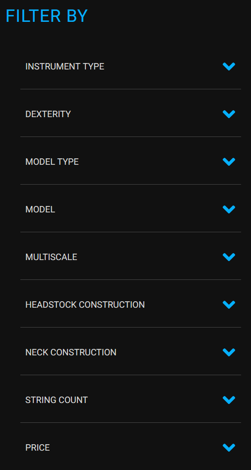

# kiesel-in-stock-finder

Simple Jupyter Notebook for getting a list of available instruments from [Kiesel Guitars](https://www.kieselguitars.com/) for a given list of specs.

## Why would I use this?

The [Instruments In Stock](https://www.kieselguitars.com/in-stocks) page has a limited set of filters which do not exhaustively cover the list of specs offered by Kiesel Guitars.

I prefer guitars with the thinner neck profile spec which is not currently filterable on Kiesel Guitar's website. It would be nice to filter the set of available instruments instead of having to click into each individual instrument.